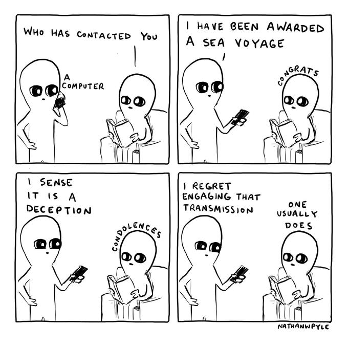

<head>
<link rel = "stylesheet" type = "text/css" href = "index.css">
</head>

# Cassidy Johnson

##### A website built by a student trying to code with one hand and drink coffee with the other

### Welcome to my website! 

##### About me: I am a college student at the University of the Pacific studying Computer Science and Applied Mathematics. I\'m particularly passionate about cyber security and data science, but always looking to broaden my horizons. I\'ll be writing about various interests on this site, not all of which will be computer science related\! I like to talk about education, my faith, hobbies, jokes, and much more. Checkout out my blog to learn more about me\!

### Menu

##### [Home](https://cassidyaj.github.io/)  [Resume](resume.html)  [Blog](blog.html)  [Contact Me](contactme.html)

##### A few of my favorite comics from Strange Planet :) 

 

###  _I\'ve always been more interested in the future than the past_  - Grace Hopper

###  _I\'m always interested in learning something new_  - Katherine Johnson

### _I\'m gonna do my best to take my place in the sun_ - Tiana, Princess and the Frog
